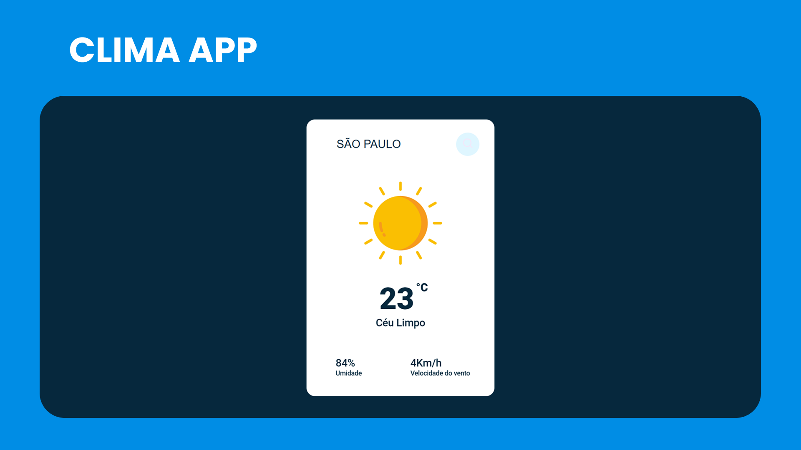

# Clima app
Simples aplicativo integrado à uma API, capaz de consultar o clima de diversos lugares em tempo real.

## Quais tecnologias foram utilizadas?
O projeto foi criado por:
- [x] HTML
- [x] CSS
- [x] JavaScript
- [x] Weather API

## API WEATHER APP
Confira a documentação: [Open Weathe API Documentation](https://openweathermap.org/api)

## Instale em sua máquina local
```
git clone https://github.com/LealDevhub/clima-app.git
```
Utilize a extensão do VS CODE para iniciar o projeto em um servidor local, *"Live Server"*

<p>Feito com amor, pelo Lealdev❤️</p>
